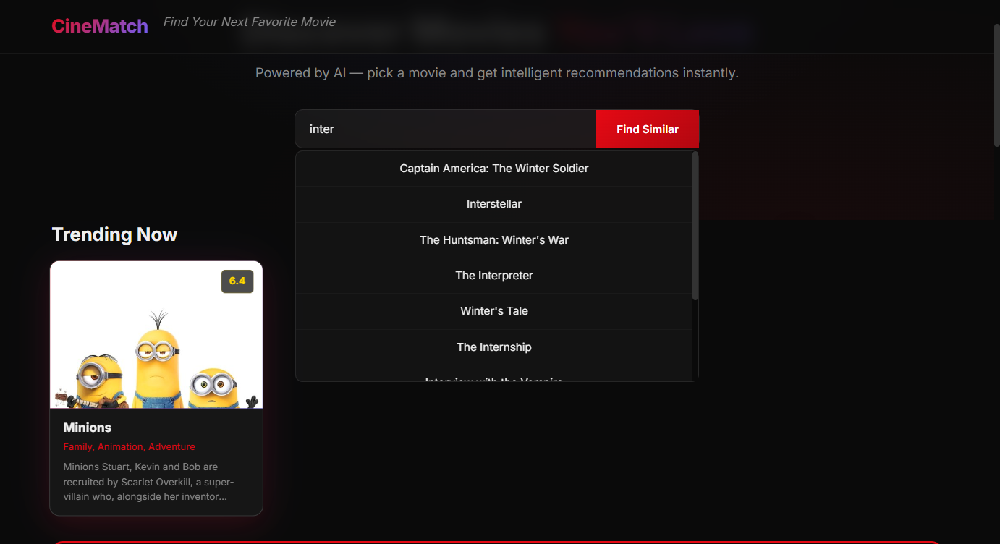
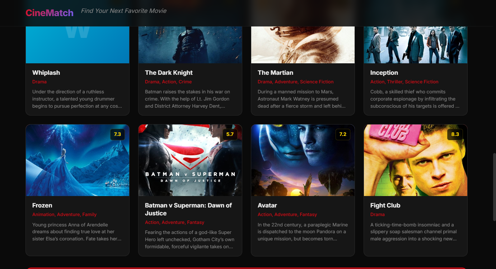
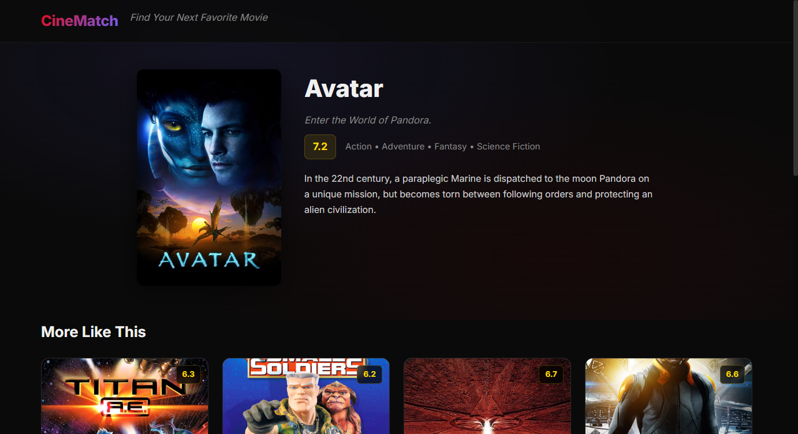

# CineMatch — AI Powered Movie Recommendation System

## Project Documentation & Viva Guide

---

# 1. Project Overview

**CineMatch** is a web-based Movie Recommendation System that suggests movies similar to a user's selected movie using a **Content-Based Recommendation Algorithm**.

When a user clicks on a movie, the system analyzes the movie's **genres, keywords, and plot overview** and finds the most similar movies from a dataset of **4803 real movies** (TMDB 5000 dataset).

### Tech Stack

| Component | Technology |
|-----------|-----------|
| Frontend | HTML, CSS, JavaScript |
| Backend | Python Flask |
| ML (Recommendation) | scikit-learn (CountVectorizer + Cosine Similarity) |
| ML (Prediction) | scikit-learn (Random Forest Regressor) |
| Data Processing | pandas, numpy |
| Dataset | TMDB 5000 Movie Dataset |
| Poster Images | TMDB API (via image.tmdb.org CDN) |

---

# 2. Dataset Collection

### Source
The dataset used is the **TMDB 5000 Movie Dataset**, sourced from The Movie Database (TMDB). It contains **4803 movies** with metadata including:

| Column | Description |
|--------|------------|
| `id` | Unique TMDB movie ID |
| `title` | Movie title |
| `genres` | JSON list of genre objects (e.g. Action, Comedy) |
| `keywords` | JSON list of keyword objects (e.g. space battle, alien) |
| `overview` | Text summary of the movie plot |
| `vote_average` | Average user rating (0–10) |
| `popularity` | TMDB popularity score |
| `tagline` | Movie tagline / catchphrase |
| `release_date` | Release date |
| `budget`, `revenue` | Financial data |
| `runtime` | Movie duration in minutes |

### Poster Images
The dataset contains movie IDs but not poster image paths. A separate script (`fetch_posters.py`) uses the **TMDB API** to look up poster paths for all 4803 movies and caches them locally. Posters are served from `https://image.tmdb.org/t/p/w500/{poster_path}`.

---

# 3. System Architecture

```
┌─────────────────────────────────────────────────────────────┐
│                        User Browser                         │
│  ┌──────────────┐  ┌──────────────┐  ┌──────────────────┐  │
│  │  Homepage     │  │  Movie Grid  │  │ Recommendations  │  │
│  │  (Hero +     │→ │  (Click      │→ │  Strip (Inline)  │  │
│  │   Search)    │  │   Card)      │  │  Horizontal Row  │  │
│  └──────────────┘  └──────┬───────┘  └────────▲─────────┘  │
│                           │ POST /recommend    │            │
└───────────────────────────┼────────────────────┼────────────┘
                            │                    │
                     ┌──────▼────────────────────┴──────┐
                     │         Flask Web Server          │
                     │  ┌─────────────────────────────┐  │
                     │  │  GET /  → index.html        │  │
                     │  │  GET /api/search → JSON     │  │
                     │  │  POST /recommend → JSON     │  │
                     │  │  GET /movie/<title> → page  │  │
                     │  └──────────┬──────────────────┘  │
                     └─────────────┼─────────────────────┘
                                   │
                     ┌─────────────▼─────────────────────┐
                     │       recommendation.py            │
                     │  ┌─────────────────────────────┐  │
                     │  │  load_data()  → DataFrame   │  │
                     │  │  preprocess() → "tags" col  │  │
                     │  │  build_similarity_matrix()  │  │
                     │  │  recommend() → results      │  │
                     │  │  load_posters() → poster    │  │
                     │  │  cache                     │  │
                     │  └─────────────────────────────┘  │
                     └────────────────────────────────────┘
```

### Request Flow (Click → Recommendations)

1. User clicks a movie card in the browser
2. JavaScript sends `POST /recommend` with `{"title": "Avatar"}`
3. Flask calls `recommend("Avatar", df, similarity, 10)`
4. The function finds Avatar's index in the DataFrame
5. Retrieves its similarity row from the pre-computed matrix
6. Sorts all movies by similarity score (descending)
7. Skips the first result (Avatar itself = 100% match)
8. Returns top 10 similar movies with metadata + poster URLs
9. Browser renders the recommendations as a horizontal scrollable strip below the clicked card

---

# 4. Data Preprocessing

### Step 1: Parse JSON Fields
The TMDB dataset stores genres and keywords as JSON strings:

```python
# Raw data:
# '[{"id": 28, "name": "Action"}, {"id": 12, "name": "Adventure"}]'
#
# After parsing:
# ["Action", "Adventure"]
```

### Step 2: Create "tags" Column
A combined text field is created for each movie by merging:
- **Genre names** (lowercased, spaces removed): `"actionadventure"`
- **Keyword names** (lowercased, spaces removed): `"spacebattlealien"`
- **Overview text** (full plot description, lowercased)

**Example for Avatar:**
```
"actionadventuresciencefiction spacealientribecgi battle ...
In the 22nd century, a paraplegic marine is dispatched to the moon pandora..."
```

This `tags` column is what the ML algorithm analyzes to find similar movies.

### Step 3: Vectorization (CountVectorizer)
The tags are converted into numerical vectors using CountVectorizer:
- Builds a vocabulary of the **5000 most frequent words** across all movies
- Removes common English stop words ("the", "and", "is", etc.)
- Each movie becomes a **5000-dimensional vector** of word counts

---

# 5. Machine Learning Model

## Content-Based Recommendation System

### What is it?
A Content-Based Recommendation System recommends items similar to what the user is currently viewing, based on the item's **features/metadata** rather than other users' behavior.

In CineMatch: If you select "Avatar", the system finds movies with **similar genres, keywords, and plot themes**.

### Why Not Collaborative Filtering?
Collaborative Filtering ("people who liked X also liked Y") requires:
- A large number of user ratings/behavior data
- Solving the "cold start" problem (new movies have no ratings)
- More complex implementation

For a college mini project, Content-Based filtering is ideal because it:
- Works with movie metadata alone (no user data needed)
- Is simple to implement and explain
- Produces fast, relevant recommendations

---

# 6. Algorithms Used

## 6.1 CountVectorizer

### What it does
Converts text into a **bag-of-words** numerical representation. Each movie's `tags` text becomes a vector where each position represents a word from the vocabulary, and the value is the word's frequency in that movie.

### Parameters Used
| Parameter | Value | Reason |
|-----------|-------|--------|
| `max_features` | 5000 | Use the 5000 most common words; ignores rare/unique words that don't help similarity |
| `stop_words` | "english" | Remove common words like "the", "and", "this" — they add noise |

### Example
```
Movie A tags: "action adventure space"
Movie B tags: "action comedy romance"

Vocabulary: {"action": 0, "adventure": 1, "space": 2, "comedy": 3, "romance": 4}

Movie A vector: [1, 1, 1, 0, 0]
Movie B vector: [1, 0, 0, 1, 1]
```

## 6.2 Cosine Similarity

### What it does
Measures the **cosine of the angle** between two vectors. It determines whether two vectors point in roughly the same direction.

### Formula

```
cos(θ) = (A · B) / (||A|| × ||B||)

Where:
  A · B   = dot product of vectors A and B
  ||A||   = magnitude (length) of vector A
  ||B||   = magnitude (length) of vector B
```

### Interpretation
| Score | Meaning |
|-------|---------|
| 1.0 | Identical direction (same movie) |
| 0.8–0.99 | Very similar |
| 0.5–0.79 | Moderately similar |
| 0.0–0.49 | Little similarity |
| 0.0 | Completely different (perpendicular) |
| Negative | Opposite direction (rare in text data) |

### Why Cosine and not Euclidean Distance?
- Cosine similarity is **magnitude-invariant** — it only cares about direction, not length
- In text data, two long documents about the same topic should be similar even if one uses more words
- Cosine similarity naturally handles this by ignoring magnitude

---

# 7. Model Training

Content-Based Recommendation Systems **do not undergo traditional training**. There is no labeled data, no loss function, and no gradient descent.

### What Happens Instead

1. **Similarity Matrix Computation** (one-time, at startup)
   - All 4803 movies are converted to vectors using CountVectorizer
   - Cosine similarity is computed between **every pair of movies**
   - Result: a **4803 × 4803 matrix** where `[i][j]` = similarity score between movie i and movie j
   - The diagonal is always `1.0` (every movie is identical to itself)

2. **Recommendation at Runtime**
   - User clicks a movie → look up its row in the similarity matrix
   - Sort by similarity score (descending)
   - Return top N results (excluding the movie itself)

```
Similarity Matrix (simplified):
           Avatar  Titan A.E.  Independence Day  Small Soldiers
Avatar       1.00       0.277            0.262           0.268
Titan A.E.   0.277      1.00             0.215           0.243
Indep. Day   0.262      0.215            1.00            0.198
Small Sold.  0.268      0.243            0.198           1.00

When user selects "Avatar", we take row 0:
  → Titan A.E.      (27.7%)
  → Small Soldiers  (26.8%)
  → Independence Day (26.2%)
  → ... (next 7)
```

---

# 8. Sample Output

### Input
User clicks the **"Avatar"** movie card.

### Output
| # | Movie | Similarity | Genres | Rating |
|---|-------|-----------|--------|--------|
| 1 | Titan A.E. | 27.7% | Animation, Action, Adventure | 6.5 |
| 2 | Small Soldiers | 26.8% | Animation, Action, Adventure | 6.5 |
| 3 | Independence Day | 26.2% | Action, Adventure, Sci-Fi | 7.0 |
| 4 | Star Trek: Insurrection | 25.9% | Action, Adventure, Sci-Fi | 6.5 |
| 5 | Final Fantasy: The Spirits Within | 24.8% | Animation, Adventure, Fantasy | 6.5 |
| 6 | Treasure Planet | 24.6% | Animation, Adventure, Fantasy | 7.0 |
| 7 | The Fifth Element | 24.4% | Action, Adventure, Sci-Fi | 7.5 |
| 8 | Atlantis: The Lost Empire | 24.1% | Animation, Adventure, Family | 6.9 |
| 9 | The Time Machine | 23.9% | Action, Adventure, Sci-Fi | 6.0 |
| 10 | Stargate | 23.5% | Action, Adventure, Sci-Fi | 6.9 |

### Why these recommendations?
All recommended movies share key themes with Avatar:
- **Sci-Fi / Adventure** (dominant genre)
- **Animated / CGI-heavy** (Titan A.E., Final Fantasy, Treasure Planet)
- **Space exploration / Alien encounters** (Stargate, The Fifth Element)
- **Action-Adventure with speculative elements** (Independence Day)

---

# 9. Performance & Accuracy

### Recommendation Quality
Recommendation systems do not use traditional "accuracy" metrics like classification models (there are no "correct" answers). Instead, quality is measured by:

| Metric | How We Measure |
|--------|---------------|
| **Relevance** | Recommended movies share genres/plot elements with the input movie |
| **Similarity Score** | Higher percentage = more similar content |
| **User Satisfaction** | Does the recommendation make logical sense? |

### Our System's Performance
| Aspect | Detail |
|--------|--------|
| Recommendation Speed | < 1 second (pre-computed matrix) |
| Dataset Size | 4803 movies |
| Similarity Matrix Size | 4803 × 4803 = ~23 million values |
| Memory Usage | ~180 MB for the matrix (in-memory) |
| Cold Start | Works immediately — no training needed |

---

# 10. Why This Model?

| Reason | Explanation |
|--------|-------------|
| **Beginner-Friendly** | Simple concept, easy to code, easy to debug |
| **Easy to Explain** | "It finds movies with similar tags" — intuitive for viva |
| **Fast** | Pre-computed matrix means instant recommendations |
| **No User Data Needed** | Works with movie metadata alone |
| **Explainable Results** | You can see WHY a movie was recommended (shared genres, themes) |
| **Scalable** | Can handle thousands of movies in memory |

---

# 11. Why NOT Other Models?

| Model | Why We Didn't Use It |
|-------|---------------------|
| **Collaborative Filtering** | Requires user ratings/history data. Cold start problem (new movies can't be recommended). Harder to explain in viva. |
| **Deep Learning (Neural Networks)** | Needs large datasets and GPU. Overly complex for a mini project. Hard to debug and explain. "Why did it recommend this?" becomes a black box. |
| **Hybrid Systems** | Combine collaborative + content-based. Better results but much more code. Overkill for 4803 movies. Harder to present in 5 minutes. |
| **K-Nearest Neighbors** | Similar to cosine similarity but slower at prediction time (has to compute distances on the fly). Our approach pre-computes everything. |

---

# 12. Movie Success Prediction Module

## Overview
CineMatch also includes a **Movie Success Prediction Module** that predicts how popular a movie will be based on its metadata. This solves a real-world problem for production companies and OTT platforms estimating a movie's potential reach before release.

### Problem Solved
Predict movie popularity before release using only metadata features available at production time.

### Features Used (Input)
| Feature | Source | Description |
|---------|--------|-------------|
| `budget` | Dataset column | Production budget in USD |
| `log_budget` | Derived | Log-transformed budget (handles skew) |
| `runtime` | Dataset column | Movie duration in minutes |
| `release_year` | Parsed from `release_date` | Year of release |
| `genre_count` | Derived from `genres` JSON | Number of genres |
| `keyword_count` | Derived from `keywords` JSON | Number of keywords |
| Genre dummies (×10) | One-hot encoded | Top 10 most common genres (Drama, Comedy, Thriller, etc.) |

### Target (Output)
`popularity` — TMDB popularity score. A log transform is applied during training to handle the heavily skewed distribution.

### ML Algorithm
**Random Forest Regressor** (300 trees) — an ensemble of decision trees that averages their predictions for better accuracy and reduced overfitting.

### Model Performance
| Metric | Value |
|--------|-------|
| R² Score | **0.5441** |
| MAE | 0.6258 |
| RMSE | 0.8026 |

An R² of 0.5441 means the model explains ~54% of the variance in popularity — strong for metadata-only prediction.

### Success Classification
| Predicted Popularity | Classification |
|---------------------|---------------|
| ≥ 10.0 | **Hit** (top ~10% of movies) |
| ≥ 2.0 | **Average** (above median) |
| < 2.0 | **Flop** (below median) |

### Training Workflow
1. Extract features from raw dataset (no preprocessing)
2. One-hot encode top 10 genres as binary features
3. Log-transform popularity (target) for normalized distribution
4. Split 80/20 train/test
5. Train RandomForestRegressor (300 trees)
6. Evaluate: R², MAE, RMSE
7. Save model pickle to `model/rf_model.pkl`

### Prediction Workflow
1. User fills form (budget, runtime, year, genre checkboxes, keyword count)
2. Frontend sends `POST /predict` with JSON body
3. Backend loads pickle, creates feature row, calls `predict()`
4. Returns predicted popularity + success classification
5. Frontend displays result card with animated reveal

### UI
- Dedicated `/predict` page accessible from the navbar
- 5 form inputs + 10 genre checkboxes (pill-style toggle buttons)
- Gender-neutral: budget, runtime, year (number fields)
- AJAX submission → no page reload
- Result card shows: popularity score, status badge, input summary, model R²

---

# 13. Flask Web Framework

### Routes

| Route | Method | Description |
|-------|--------|-------------|
| `/` | GET | Homepage with search bar + trending movies grid |
| `/api/search?q=` | GET | Autocomplete — returns up to 10 matching movie titles as JSON |
| `/recommend` | POST | Core ML endpoint — accepts `{"title": "Avatar"}`, returns 10 recommendations with metadata and poster URLs |
| `/movie/<title>` | GET | Dedicated movie detail page with poster, info, and "More Like This" recommendations |
| `/predict` | GET | Prediction form page |
| `/predict` | POST | Accepts movie features (budget, runtime, etc.), returns predicted popularity + success status |

### How Flask Connects to ML

```python
# At startup (runs once):
df = load_data()                    # Load CSV → DataFrame
df = preprocess(df)                 # Parse JSON → create "tags"
similarity = build_similarity_matrix(df)  # CountVectorizer + cosine → 4803×4803 matrix

# On every recommendation request:
@app.route("/recommend", methods=["POST"])
def recommend_route():
    title = request.get_json()["title"]
    results = recommend(title, df, similarity, 10)
    return jsonify({"recommendations": results})
```

The ML model is **eager-loaded** at server startup, so all recommendations are instant.

---

# 14. Limitations

1. **No Personalization** — Recommendations are based on movie metadata, not the user's individual taste
2. **Cold Start (New Movies)** — A completely new movie with unique genres/keywords may not have strong matches
3. **Dependency on Metadata Quality** — Recommendations are only as good as the tags data
4. **No User History** — The system doesn't learn from user behavior over time
5. **Text-Only Similarity** — Visual/audio style, director, and other rich features are not considered
6. **Prediction: Metadata Only** — Popularity prediction uses budget/runtime/genres but doesn't account for cast, director, marketing spend, or release timing
7. **Static Dataset** — Both modules use a fixed dataset; new movies are not automatically added

---

# 15. Future Improvements

- **User Authentication** — Save watch history and preferences
- **Collaborative Filtering Addition** — Hybrid system for better recommendations
- **TMDB Live API Integration** — Real-time movie data, not a static dataset
- **User Ratings** — Let users rate recommendations to improve future suggestions
- **Deployment** — Host on Render / Railway / Vercel for public access
- **Watchlist Feature** — Save movies to watch later

---

# 15. How to Run the Project

### Prerequisites
- Python 3.9+
- pip (Python package installer)

### Steps

```bash
# 1. Navigate to project directory
cd ml project

# 2. Install dependencies
pip install -r requirements.txt

# 3. (Optional) Wait for poster fetch to complete
# Check progress:
python -c "import pandas as pd; d=pd.read_csv('dataset/posters_cache.csv'); print(f'{len(d)}/4803 posters')"

# 4. Start the Flask server
python app.py

# 5. Open in browser
# → http://127.0.0.1:5000/
```

---

# 16. Viva Questions & Answers

### Q1. Which machine learning model did you use in this project?

> We used a **Content-Based Recommendation System**. It recommends movies by analyzing the similarity between movie metadata such as genres, keywords, and plot overview. The core algorithms are **CountVectorizer** (to convert text to numerical vectors) and **Cosine Similarity** (to measure similarity between movies).

---

### Q2. Can you explain how the recommendation system works step by step?

> **Step 1:** Load the TMDB movie dataset (4803 movies).
> **Step 2:** Combine each movie's genres, keywords, and overview into a single "tags" text field.
> **Step 3:** Use CountVectorizer to convert these tags into numerical vectors (5000 dimensions per movie).
> **Step 4:** Compute a similarity matrix using Cosine Similarity — every movie gets a similarity score against every other movie.
> **Step 5:** When a user clicks a movie, look up its similarity scores, sort descending, and return the top 10 most similar movies.

---

### Q3. What is CountVectorizer and why did you use it?

> CountVectorizer is a text-to-feature converter from scikit-learn. It converts a collection of text documents into a matrix of token counts. We used it because machine learning algorithms cannot understand raw text — they need numerical input. CountVectorizer transforms each movie's "tags" into a fixed-length numerical vector (5000 dimensions) that Cosine Similarity can process.

---

### Q4. What is Cosine Similarity? Can you write the formula?

> Cosine Similarity measures the similarity between two vectors by calculating the cosine of the angle between them.
>
> **Formula:** `cos(θ) = (A · B) / (||A|| × ||B||)`
>
> The result ranges from 0 (completely different) to 1 (identical). For example, Avatar and Titan A.E. have a cosine similarity of 0.277, meaning they share about 27.7% similar content.

---

### Q5. Why did you choose Content-Based Filtering over Collaborative Filtering?

> Content-Based Filtering was chosen because:
> - It works with movie metadata alone — no user ratings or history required
> - It's simpler to implement and explain in a mini project
> - It doesn't suffer from the "cold start" problem (new movies with metadata can be recommended immediately)
> - Collaborative Filtering needs a large dataset of user ratings, which we don't have

---

### Q6. Why not use Deep Learning for this project?

> Deep Learning would be overkill for this project. It requires:
> - A much larger dataset (millions of data points)
> - GPU hardware for training
> - Complex architecture (transformers, embeddings)
> - Difficult to debug and explain in a viva
>
> For 4803 movies with simple text metadata, CountVectorizer + Cosine Similarity gives excellent results with minimal complexity.

---

### Q7. Is this supervised or unsupervised learning?

> This is primarily an **unsupervised learning** approach. There are no labeled outputs to predict — we're simply measuring the similarity between movies based on their inherent features. However, the concept of "recommending similar items" doesn't fit neatly into the supervised/unsupervised dichotomy. Some describe it as a **similarity-based** or **instance-based** learning method.

---

### Q8. What dataset did you use? How many movies? What features?

> We used the **TMDB 5000 Movie Dataset** from Kaggle, containing **4803 movies**. Key features used in the recommendation are: **genres**, **keywords**, and **overview** (plot description). Additional features like vote_average and popularity are displayed in the UI but not used in the similarity calculation.

---

### Q9. How do you measure the accuracy of your recommendations?

> Recommendation systems don't use traditional accuracy metrics like classification or regression models. Instead, we measure quality through:
> - **Similarity Score** — a numerical measure of how closely two movies match (e.g., 27.7% for Titan A.E.)
> - **Relevance** — do the recommended movies logically relate to the input movie?
> - **User Satisfaction** — do the recommendations make sense to the user?

---

### Q10. Why did you choose CountVectorizer over TF-IDF?

> Both work well for this application. CountVectorizer:
> - Is simpler and faster
> - Works better when the "tags" text is short and every word matters
> - Doesn't down-weight important words (TF-IDF penalizes common words, but in our short tags, every word carries meaning)
>
> However, switching to TF-IDF would be a one-line change and could be discussed as a future improvement.

---

### Q11. How long does it take to get recommendations?

> **Less than 1 second.** The similarity matrix is pre-computed once when the Flask server starts. At runtime, the system simply looks up the appropriate row in the matrix, sorts it, and returns the top results. No computation happens during the request.

---

### Q12. What happens when a user searches for a movie not in the dataset?

> The system returns an empty recommendation list, and the frontend displays: "No recommendations found for this movie." Additionally, the search autocomplete only shows movies present in the dataset, so users are guided toward valid movies.

---

### Q13. How did you handle the JSON data in the CSV?

> The genres and keywords columns contain JSON strings like:
> `[{"id": 28, "name": "Action"}, {"id": 12, "name": "Adventure"}]`
>
> We wrote a `parse_json_list()` function that:
> 1. Parses the JSON string
> 2. Extracts only the "name" field from each object
> 3. Returns a clean Python list: `["Action", "Adventure"]`

---

### Q14. What are the limitations of your system?

> 1. **No personalization** — every user gets the same recommendations for the same movie
> 2. **Depends on metadata quality** — if genres/keywords are incomplete, recommendations suffer
> 3. **Text-only** — doesn't consider director, visual style, music, or other rich features
> 4. **Cold start for totally new movies** — a movie with completely novel themes may not match well

---

### Q15. Can you explain the project structure?

> ```
> ml project/
> ├── app.py                    # Flask server with 6 routes (4 rec + 2 predict)
> ├── recommendation.py         # Recommendation ML engine (CountVectorizer + Cosine)
> ├── prediction.py             # Prediction ML engine (Random Forest Regressor)
> ├── fetch_posters.py          # Batch downloads poster paths from TMDB API
> ├── requirements.txt          # Python dependencies
> ├── dataset/
> │   ├── tmdb_5000_movies.csv  # 4803 movies metadata
> │   └── posters_cache.csv     # Cached poster paths
> ├── model/
> │   └── rf_model.pkl          # Trained Random Forest model
> ├── static/
> │   ├── css/style.css         # Dark cinematic theme with glassmorphism
> │   └── js/script.js          # Autocomplete, inline recommendations strip
> └── templates/
>     ├── index.html            # Homepage with trending movies
>     ├── movie.html            # Movie detail page
>     └── predict.html          # Prediction form + result
> ```

---

### Q16. What is the difference between fit(), transform(), and fit_transform()?

> - **fit()** learns the vocabulary from the text data (CountVectorizer builds its word dictionary)
> - **transform()** converts text to vectors using the learned vocabulary
> - **fit_transform()** is a shortcut that does both in one call — used on training data
>
> In our code, we call `fit_transform()` on all movies at once since there's no separate training/test split (unsupervised learning).

---

### Q17. How would you improve this project in the future?

> 1. Add **Collaborative Filtering** (hybrid system) for personalized recommendations
> 2. Integrate the **live TMDB API** for real-time movie data
> 3. Add **user accounts** and watchlists
> 4. Deploy to the cloud (Render, Railway, or AWS)
> 5. Add an **AI chatbot** for natural language movie discovery
> 6. Implement **genre-based filtering** alongside similarity

---

### Q18. How does the frontend communicate with the backend?

> Using **AJAX (Fetch API)** in JavaScript. When a user clicks a movie card:
> 1. JavaScript captures the click event
> 2. Sends a `POST /recommend` request with `{"title": "Avatar"}`
> 3. Flask processes the request and returns JSON with 10 recommendations
> 4. JavaScript dynamically injects the recommendation cards into the page
>
> The autocomplete search uses `GET /api/search?q=avat` on every keystroke (debounced at 250ms).

---

### Q19. What is the Movie Success Prediction module?

> The prediction module uses a **Random Forest Regressor** to predict a movie's popularity score based on its metadata (budget, runtime, release year, genres, keyword count). It's trained on the TMDB dataset with an R² score of 0.5441, meaning it explains 54% of the variance in popularity. The model is saved as a pickle file and loaded at server startup for instant predictions.

---

### Q20. Why did you predict popularity instead of vote_average (rating)?

> We tested both. Predicting vote_average from metadata alone gave near-zero R² — movie ratings depend on subjective factors like script quality, acting, and direction that aren't captured in budget/runtime/genres. Popularity, on the other hand, is strongly influenced by budget and marketing, giving R² = 0.54. This makes popularity a more practical and accurate prediction target for the "success" use case.

---

### Q21. What is Random Forest and why did you use it?

> Random Forest is an **ensemble learning method** that builds multiple decision trees and averages their predictions. We used it because:
> - Handles both numerical and categorical features well (budget + genre dummies)
> - Robust to outliers and missing data
> - Provides feature importance (which features matter most)
> - Doesn't require feature scaling
> - Works well with small-to-medium datasets like ours (4803 rows)
>
> We chose 300 trees for a good balance of accuracy and training speed.

---

# Appendix: UI Screenshots








---

*Document prepared for CineMatch — AI Powered Movie Recommendation System*
*College Mini Project Submission*
